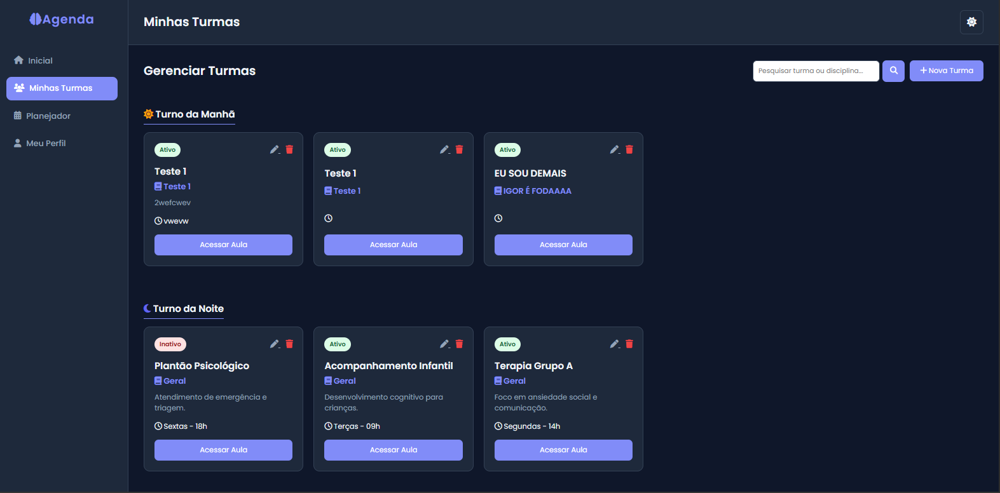

# 🧠 PsicoHub - Sistema de Gestão Escolar

> Um painel administrativo focado em organização pedagógica e gestão de turmas para psicologia e educação.


## 💻 Sobre o Projeto

O **PsicoHub** é uma aplicação web desenvolvida para auxiliar professores e gestores na organização do dia a dia escolar. Diferente de sistemas comuns, ele foca na experiência do usuário com um **Modo Escuro (Dark Mode)** elegante e ferramentas de apoio pedagógico, como planejador criativo e dicas diárias.

## ✨ Funcionalidades Principais

* **📊 Dashboard Interativo:** Visão geral de turmas, eventos e status do sistema.
* **🏫 Gestão de Turmas:**
    * Organização visual por Turnos (Manhã/Noite) e Períodos (1º ao 10º Semestre).
    * Cadastro, Edição e Exclusão de turmas.
    * Visualização rápida via Cards.
* **💡 Planejador Criativo:** Ferramenta para registrar planos de aula com "Dica Pedagógica do Dia".
* **📝 Notas Rápidas (Sticky Notes):** Bloco de anotações que salva automaticamente no navegador.
* **📅 Calendário Acadêmico:** Visualização mensal de eventos e compromissos.

## 🛠 Tecnologias Utilizadas

* **Back-end:** PHP (Nativo)
* **Banco de Dados:** MySQL
* **Front-end:** HTML5, CSS3 (Responsivo & Dark Mode), JavaScript
* **Servidor Local:** XAMPP (Apache)

## 📸 Screenshots
### Dashboard


### Gestão de Turmas



## 🚀 Como Rodar o Projeto

### Pré-requisitos
* Ter o **XAMPP** instalado (ou outro servidor Apache/MySQL).
* Ter o **Git** instalado.

### Passo a Passo

1.  **Clone o repositório** na pasta do seu servidor (ex: `htdocs`):
    ```bash
    git clone [https://github.com/SEU_USUARIO/psicohub.git](https://github.com/SEU_USUARIO/psicohub.git)
    ```

2.  **Importe o Banco de Dados:**
    * Abra o phpMyAdmin (http://localhost/phpmyadmin).
    * Crie um banco de dados chamado `psicohub`.
    * Importe o arquivo `psicohub.sql` que está na raiz do projeto.

3.  **Configure a Conexão:**
    * Verifique se o arquivo `config/db.php` está com a senha correta do seu MySQL (geralmente `root` e senha vazia no XAMPP).

4.  **Acesse o Projeto:**
    * Abra o navegador e digite: `http://localhost/psicohub`

## 👨‍💻 Autor

Desenvolvido por **Igor Johnson** .

---
*Projeto desenvolvido para fins de estudo e portfólio.*